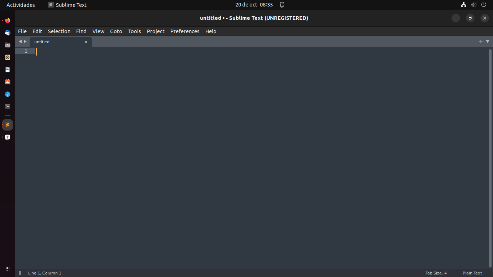
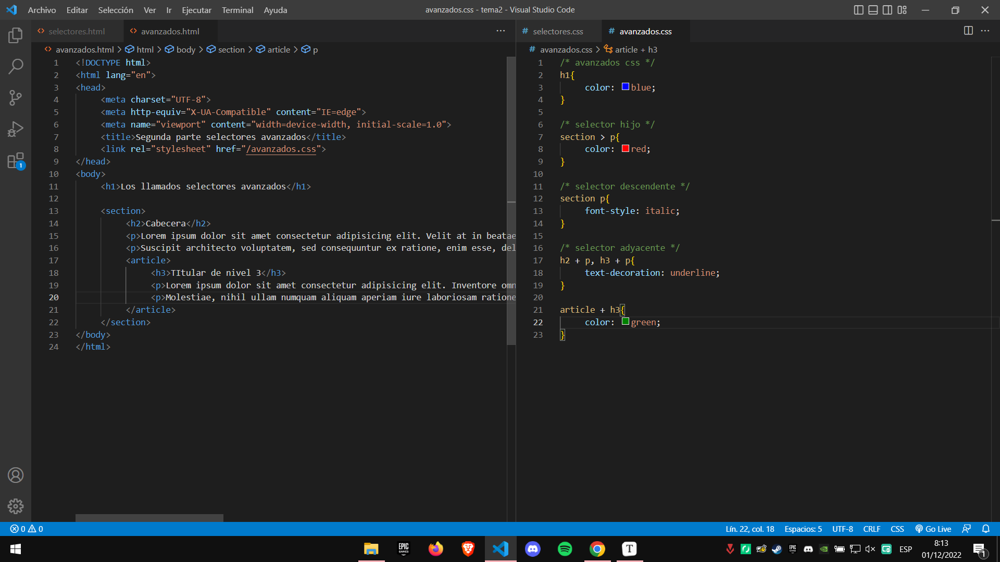
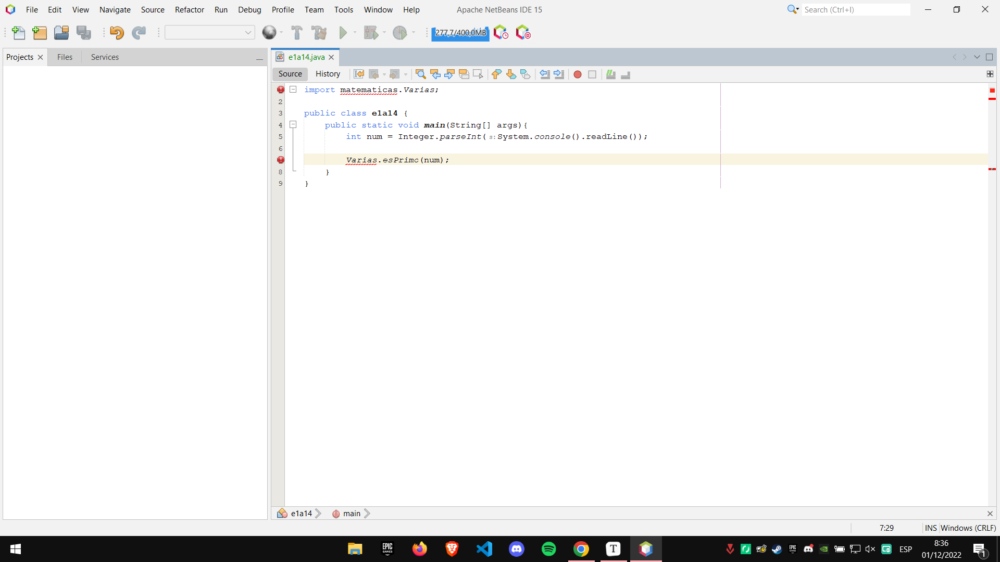

# ENTORNOS DE DESARROLLO INTEGRADO

#### 1. Instala el editor sublime text. Saca una captura de pantalla una vez instalado.

#### 2. Personaliza Sublime text instalando los complementos más importantes. 

- Package Control instalado
- Emmet
- SideBarEnhacements
- HTML-CSS-JS Prettify
- Color Highlighter
- BracketHighlighter
- HTML5
- Terminal
- JavaScriptNext
- PackageDev

#### 3. ¿Para que sirve el complemento **Emmet**? Haz uso de él al escribir un archivo html de prueba.

- Emmet es un conjunto de complementos para editores de texto que permiten la codificación y edición de alta  velocidad en HTML, XML, XSL y otros formatos de código estructurado a  través de la asistencia de contenido. Emmet, escribe código HTML y CSS a base de abreviaciones.

#### 4. Instala el editor Visual Studio Code. Saca una captura de pantalla una vez instalado y funcionando.

#### 6. ¿Qué paquetes básicos debemos instalar en Ubuntu para desarrollar en Java?

- Debemos instalar un JDK (Java Development Kit), ya sea el oficial de Oracle u Open JDK.

#### 7. Instala el entorno integrado Netbeans. Saca una captura de pantalla una vez instalado y funcionando.

